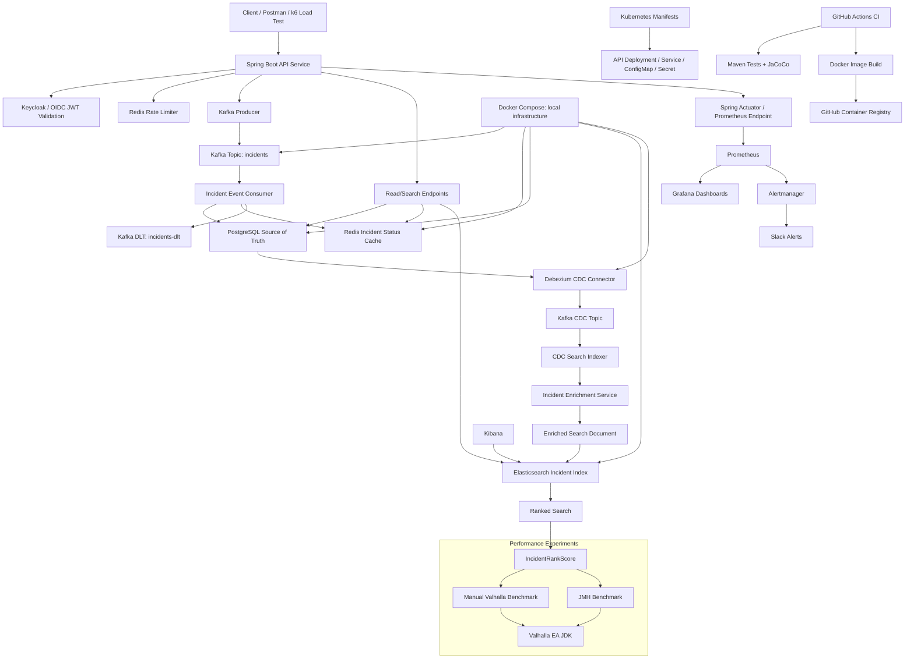

# Event Analysis Platform System Architecture and Data Flow

This document shows the current high-level system design for the Event Analysis Platform.

## Summary

Requests enter through the Spring Boot API. Authentication and authorization are handled with Keycloak/OIDC JWT validation.

Incident writes are published to Kafka. Kafka consumers persist incidents into PostgreSQL and update Redis with incident processing status.

PostgreSQL changes are captured by Debezium CDC and published back into Kafka. A CDC search indexer consumes those events, enriches the incident data, and writes searchable documents into Elasticsearch.

Read APIs query PostgreSQL, Redis, or Elasticsearch depending on the endpoint. Ranked search uses `IncidentRankScore` to combine operational priority with Elasticsearch relevance.

Prometheus, Grafana, Alertmanager, and Slack provide observability and alerting. Kibana is used to inspect Elasticsearch data.

Docker Compose supports local infrastructure. Kubernetes manifests support API deployment structure. GitHub Actions runs tests, builds the Docker image, and publishes it to GitHub Container Registry.

Project Valhalla and JMH are isolated experiments. They are not in the production request path. They test whether compact ranked-search score objects could benefit from future JVM value-object optimizations.